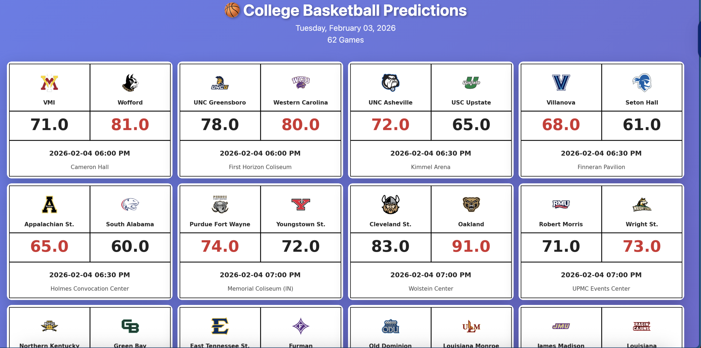
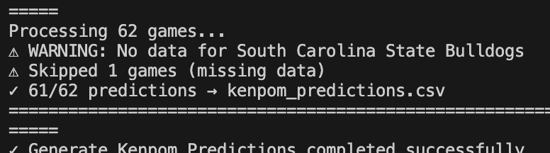
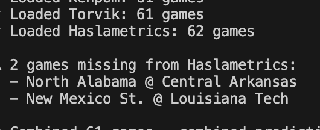

# College Basketball Prediction Model

Uses multiple college basketball analytic sites-- Kenpom, Barttorvik, and Haslametrics to form predictions of D1 college basketball games taking place on a given date. 

## Overview

This project automates the entire prediction pipeline for college basketball games. It fetches daily matchups from ESPN, pulls data from multiple analytical sources, averages the predictions, and generates visual game cards with team logos, score, date, time, and location of the game.
ETE
## Features

- **Automated ETL Pipeline** - End-to-end data extraction, transformation, and loading from heterogeneous sources
- **Data Integration** - Combines three analytical systems with entity resolution and schema alignment
- **Ensemble Modeling** - Averages the predicted scores based on each individual data source to arrive at a "true" score of a game
- **Feature Engineering** - Transforms raw efficiency metrics into predictive features
- **Interactive Visualizations** - Clean, branded game cards with team logos and predicted outcomes
- **Pipeline Orchestration** - Single-command execution of the complete prediction workflow
- **Team Name Standardization** - Resolves naming conflicts across data sources by mapping all team name variations to a canonical identifier (using kenpom naming as the base).

## Installation

### Prerequisites

- KenPom API Access (requires paid subscription at kenpom.com - $95/year)
  - **Alternative:** If you don't have API access, you can manually extract data from the base KenPom website by copying team names and their adjusted efficiency ratings into a spreadsheet, saving as CSV, and uploading to the project directory as `kenpom_data.csv`. Or only use barttorvik and haslametrics.


### Setup

1. **Clone the repository:**
```bash
git clone https://github.com/YOUR_ACTUAL_USERNAME/cbb-prediction-model.git
cd cbb-prediction-model
```


2. **Install required packages:**
```bash
pip install -r requirements.txt
```

3. **Set up env file:**

Create a `.env` file in the project root:

KENPOM_API_KEY=your_api_key_here


## Usage

### Running the Complete Pipeline

Execute the master script (run_all.py) to run the entire prediction workflow:
```bash
python run_all.py
```

This will:
1. Fetch today's matchups from ESPN
2. Pull KenPom efficiency ratings via API
3. Scrape Torvik analytics data
4. Scrape Haslametrics predictions
5. Combine all models and average
6. Generate visual game cards
7. Create an HTML index file with all predictions

### Viewing Results

After the pipeline completes:
- **Predictions data:** `combined_predictions.csv`
- **Visual game cards:** `predictions/index.html` (open in your browser)

### Running Individual Scripts

You can also run individual components:
```bash
# Fetch today's games only
python fetch_daily_games.py

# Get KenPom data only
python kenpom_fetch.py

# Generate visualizations only
python game_card_generator.py
```

## Project Structure
```
cbb-prediction-model/
│
├── run_all.py                    # Master pipeline orchestration script
│
├── fetch_daily_games.py          # Scrapes ESPN for today's matchups
├── daily_matchups.csv            # Output: List of games to predict
│
├── kenpom_fetch.py               # Fetches KenPom data via API
├── kenpom_data.csv               # Output: KenPom efficiency ratings
├── kenpom_game_output.py         # Generates KenPom predictions
├── kenpom_predictions.csv        # Output: KenPom score predictions
├── kenpomHCA.csv                 # Input: Home court advantage data
│
├── torvik_scrape.py              # Scrapes Torvik analytics
├── torvik_data.csv               # Output: Torvik team ratings
├── torvik_game_output.py         # Generates Torvik predictions
├── torvik_predictions.csv        # Output: Torvik score predictions
│
├── haslametric_scrape.py         # Scrapes Haslametrics predictions
├── haslametrics_predictions.csv  # Output: Haslametrics data
│
├── combine_predictions.py        # Combines all models with weighting
├── combined_predictions.csv      # Output: Final consensus predictions
│
├── game_card_generator.py        # Creates visual game cards
├── predictions/                  # Output: HTML game cards + index
│   ├── index.html               # Main visualization page
│   └── [team]_vs_[team].png     # Individual game cards
│
├── team_mapping.py               # Normalizes team names across sources
├── espn_logo_mapping.py          # Maps teams to ESPN logo URLs
├── espn_team_logos.json          # ESPN logo database
│
├── .env                          # Environment variables (API keys)
├── .gitignore                    # Git ignore rules
├── requirements.txt              # Python dependencies
└── README.md                     # This file
```

### Data Flow
```
fetch_daily_games.py → daily_matchups.csv
                              ↓
                    [For each team in matchups]
                              ↓
        ┌─────────────────────┼─────────────────────┐
        ↓                     ↓                     ↓
kenpom_fetch.py      torvik_scrape.py    haslametric_scrape.py
        ↓                     ↓                     ↓
kenpom_game_output.py torvik_game_output.py  (predictions ready)
        ↓                     ↓                     ↓
kenpom_predictions.csv torvik_predictions.csv haslametrics_predictions.csv
        └─────────────────────┼─────────────────────┘
                              ↓
                    combine_predictions.py
                              ↓
                    combined_predictions.csv
                              ↓
                    game_card_generator.py
                              ↓
                      predictions/index.html
```

## How It Works

### Data Collection

The model pulls data from three analytical sources:

1. **KenPom** - Adjusted offensive/defensive efficiency, tempo, strength of schedule
2. **Torvik** - Advanced tempo-free statistics and team ratings  
3. **Haslametrics** - Composite analytical ratings

### Prediction Generation

Each source generates independent score predictions based on their metrics:
- **KenPom:** Uses adjusted efficiency ratings and possessions to calculate expected points and adds home court advantage (won't if game is at a neutral site)
- **Torvik:** Same as Kempon, except it uses torviks adjusted efficiencies
- **Haslametrics:** Provides direct score predictions from website's main page
    - **Note:** No machine learning is used to predict future outcomes based on past outcomes as college basketball teams do not stay consistent. Using historical data for sports are not proven predictors of a current teams success. However, adjusted efficiencies currently connected to each team are.


### Output Generation

Visual game cards include:
- Team logos
- Predicted scores
- Point spread
- Model consensus indicator
- Game time and date

## Sample Output



## Error Handling

- The team mapping data base contains almost all necessary name variations to construct predictions with no inconsistencies, however the volume of D1 college basketball teams is considerably large and it's possible there are still some inconsistencies in team mapping.





- It's also entirely possible espn's naming conventions will also arise an issue and the error will look similar to the two images above. The fix is simple, add the new naming convention to the specific team's key-value pairing, save the file, and then re-run the game output code.


## License

This project is licensed under the MIT License - see the [LICENSE](LICENSE) file for details.

## Sources

- KenPom for pioneering tempo-free basketball analytics
- Bart Torvik for comprehensive advanced metrics
- Haslametrics for independent analytical perspective
- ESPN for game schedule data and team logo pngs

---

**Note:** This is an independent project and is not affiliated with or endorsed by KenPom, Torvik, Haslametrics, or ESPN.